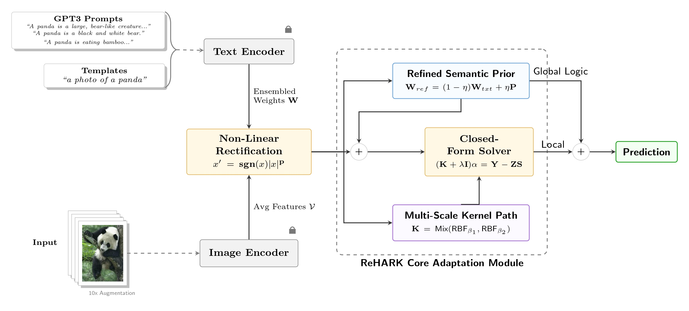
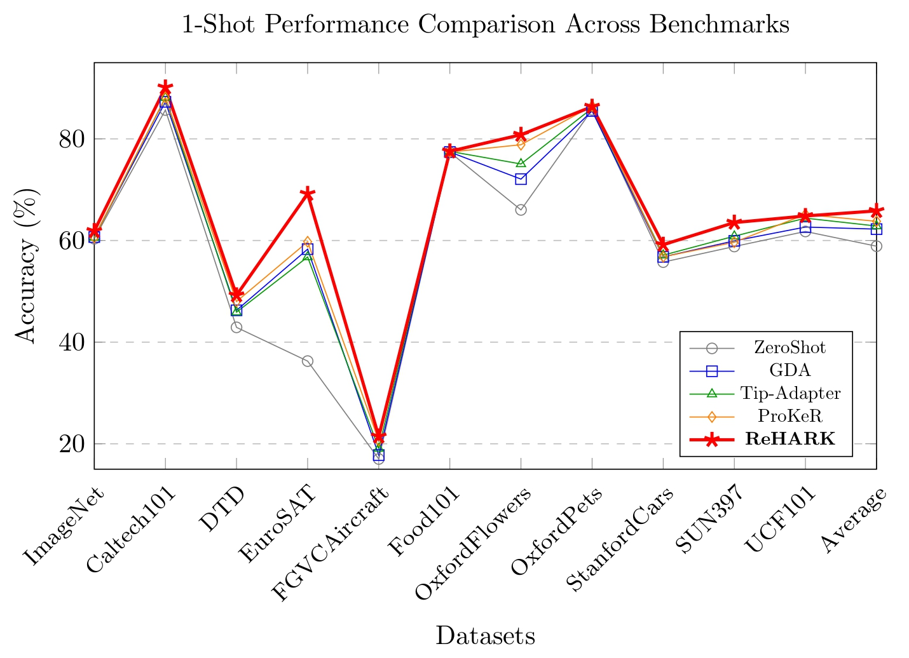

# ReHARK  
**Refined Hybrid Adaptive RBF Kernels for Robust One-Shot Vision-Language Adaptation**

**Md Jahidul Islam**  
Department of Electrical and Electronic Engineering  
Bangladesh University of Engineering and Technology (BUET)  
Preprint, 2026

---

## 🔍 Overview

Adapting large-scale Vision-Language Models (VLMs) such as **CLIP** to downstream tasks with *extremely limited data*—especially in the **one-shot regime**—remains challenging due to the **Stability–Plasticity dilemma**.

Existing *training-free* methods (e.g., Tip-Adapter, ProKeR) largely behave as **local Nadaraya–Watson estimators**, suffering from boundary bias and weak global structural regularization.

To address these limitations, we propose **ReHARK**, a **training-free**, globally regularized adaptation framework that operates in a **Reproducing Kernel Hilbert Space (RKHS)** using **Refined Hybrid Adaptive RBF Kernels**.

ReHARK establishes a **new state-of-the-art** for one-shot vision-language adaptation across **11 diverse benchmarks**, achieving an **average accuracy of 65.83%** using a ViT-B/16 CLIP backbone.

---

## ✨ Key Idea


ReHARK reframes few-shot adaptation as **global proximal regularization in RKHS**, enabling robust adaptation while preserving zero-shot knowledge.

The framework introduces a **multi-stage refinement pipeline**:

1. **Hybrid Prior Construction**  
   Combines:
   - Zero-shot CLIP textual embeddings  
   - High-density GPT-3 semantic descriptions  
   - Visual class prototypes  

2. **Support Set Augmentation (Bridging)**  
   Generates intermediate samples to smooth transitions between visual and textual modalities.

3. **Adaptive Distribution Rectification**  
   Aligns test feature statistics with the augmented support set to reduce domain shift.

4. **Multi-Scale RBF Kernel Ensemble**  
   Captures both local and global feature geometries through adaptive kernel mixing.

---

## 🚀 Contributions

- **ReHARK**: A fully *training-free* framework resolving the Stability–Plasticity dilemma via global RKHS regularization.
- **Hybrid Semantic–Visual Prior** combining CLIP, GPT-3, and visual prototypes for a stable global anchor.
- **Multi-Scale Adaptive RBF Kernel Ensemble** for robust geometry modeling in high-variance one-shot settings.
- **Extensive evaluation on 11 benchmarks**, achieving a new SOTA **65.83%** average accuracy.

---

## 📊 1-Shot Performance (ViT-B/16 CLIP)

Classification accuracy (%) in the **1-shot** setting:

| Method | ImageNet | EuroSAT | DTD | Food101 | Pets | SUN397 | UCF101 | Avg |
|------|---------|---------|-----|--------|------|--------|--------|------|
| Zero-Shot CLIP | 60.35 | 36.27 | 42.91 | 77.37 | 85.72 | 58.82 | 61.78 | 58.88 |
| GDA | 60.68 | 58.30 | 46.26 | 77.42 | 85.49 | 59.93 | 62.65 | 62.24 |
| Tip-Adapter | 60.58 | 56.76 | 45.90 | 77.54 | 86.02 | 60.15 | 64.40 | 62.85 |
| ProKeR | 60.77 | 59.75 | 47.99 | 77.40 | 86.44 | 59.61 | 65.13 | 63.77 |
| **ReHARK (Ours)** | **61.88** | **69.19** | **49.23** | **77.55** | **86.34** | **63.53** | **64.83** | **65.83** |

📌 ReHARK shows especially strong gains on **structure-sensitive datasets** such as **EuroSAT** and **DTD**.

---

## 🛠 Installation

### Environment Setup

This repository is built on **Python + PyTorch**, following the **CoOp / dassl** ecosystem.

```bash
# Clone the repository
git clone https://github.com/yourusername/ReHARK.git
cd ReHARK

# Install dependencies (following CoOp setup)
pip install -r requirements.txt
```
Please refer to the original **CoOp** repository for detailed `dassl` installation instructions.

---

## 🔧 Hyperparameter Optimization

We use **Optuna** for hyperparameter selection.

A **search budget of 1000 trials** is recommended to ensure convergence of:

- RBF kernel scales  
- Kernel mixing weights  
- Distribution rectification coefficients  

---

## 🧠 GPT-3 Semantic Descriptions

- GPT-3 class descriptions are used to construct the **Hybrid Prior**.
- Semantic descriptors are **ensembled** following the methodology introduced in **LwEIB**.
- Text prompts are cached and reused to preserve the **training-free adaptation** property.

---

## ▶️ How to Run

### Example: 1-Shot Evaluation on ImageNet

```bash
python main.py \
    --config-file configs/trainers/ReHARK/vit_b16.yaml \
    --dataset-config-file configs/datasets/imagenet.yaml \
    --trainer ReHARK \
    --shot 1 \
    --search_budget 1000
```
## 📌 Citation

If you find this work useful for your research, please cite:

```bibtex
```
## 🤝 Acknowledgements

This work builds upon and benefits from several outstanding prior works and open-source frameworks, including:

- **Tip-Adapter**
- **ProKeR**
- **LwEIB**
- **CoOp**
## 📬 Contact

For questions, discussions, or collaboration opportunities, please feel free to reach out:

**Md Jahidul Islam**  
Department of Electrical and Electronic Engineering  
Bangladesh University of Engineering and Technology (BUET)  

📧 Email: *[2006123@eee.buet.ac.bd]*
